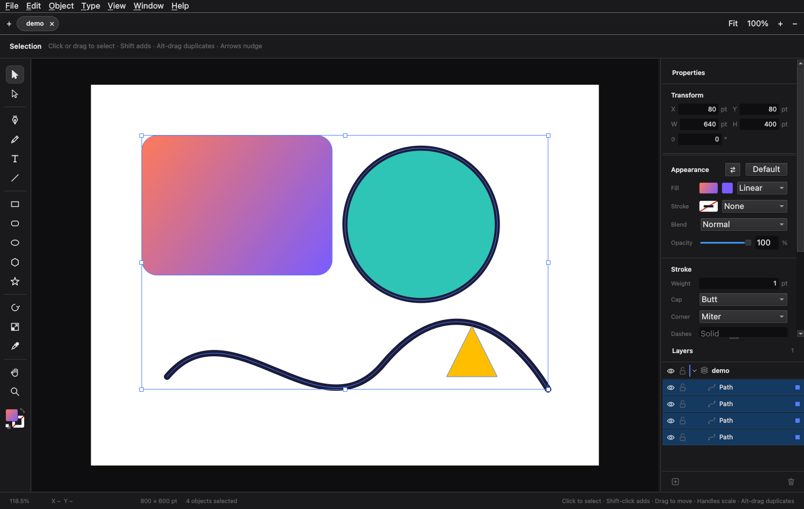

# Omastrator

Omastrator is a vector illustration app for Linux, built for
[Omarchy](https://omarchy.org). It works the way Illustrator does: the same
tools, the same shortcuts (Ctrl for ⌘) and the same menus. It also follows your
Omarchy theme and changes with it.



## Features

- Selection and direct selection, with scale and rotate handles, marquee
  selection, nudging, and smart guides that snap to other objects and the
  artboard.
- Pen, pencil, line, rectangle, rounded rectangle, ellipse, polygon and star
  tools, all producing editable Bézier paths.
- Point type, edited in place on the canvas, with Create Outlines.
- Fills and strokes: solid colours and linear or radial gradients, stroke
  weight, caps, corners and dashes, opacity and blend modes.
- Layers and groups with visibility, locking and drag-to-reorder, clipping masks
  and compound paths.
- Pathfinder (Unite, Minus Front, Intersect, Exclude), plus Outline Stroke,
  Offset Path and Simplify.
- Align and distribute, arrange, and transform: move, rotate, reflect and scale.
- Image Trace, which turns placed images into filled paths in black and white
  or in colour.
- Files:
  - saves and opens `.omai` documents (oh my)
  - imports SVG
  - exports SVG, PDF (kept as vectors), PNG and JPEG
  - places JPEG, PNG, TIFF, WebP and GIF images
- Tabs for several documents at once, and every keyboard shortcut can be
  remapped.

## AI, with the agent you already use

Omastrator bundles no model. It hands work to your Omarchy default agent, such
as Claude Code, Codex or opencode. Anything the agent changes shows as a
preview: Enter keeps it as one undo step, and Esc throws it away.

- **Object ▸ Generate…**: describe what you want and choose how many
  variations. Pick one from the Variations panel, then refine it ("rounder",
  "fewer colours").
- **Object ▸ Edit with Instruction…**: for example "recolor to a sunset
  palette" or "make these icons consistent".
- **Object ▸ Image Trace ▸ Vectorize with AI…**: a classic trace first, then
  the agent cleans it up. There are two modes, *Logo & icon* and *Sketch & line
  art*.
- **Roast My Design** (the flame at the bottom of the tool rail): a savage
  roast of the design, then sincere, specific fixes, then one click to make
  variations from that feedback.
- **Help ▸ Connect an Agent…**: drive Omastrator from any agent. Use
  `omastrator agent <method>` from a shell, or register the MCP server with
  `claude mcp add omastrator -- omastrator --mcp`.

Choose your agent in Omarchy → Setup → Default → Agent. How it works:
[docs/AI-DESIGN.md](docs/AI-DESIGN.md). The rest of the app's personality is
described in [docs/HUMOR.md](docs/HUMOR.md).

## Across Omarchy

Omastrator also works outside its window, through Omarchy's own shell
([docs/OS-SUITE.md](docs/OS-SUITE.md)):

- **The island**: a pill under the bar with modes. *Draw* holds the canvas
  tools; *Capture* picks a colour anywhere on screen, traces a screenshot
  region, pastes clipboard SVG as paths, or loads your theme's colours as
  swatches. *AI* starts Generate…, Edit with Instruction…, Roast My Design and
  Vectorize with AI, and shows when your agent is working.
- **The tray light**: one glyph in the bar that shows when your agent is
  working, when results are ready, or when something went wrong. Click it for
  the island's AI mode.
- **Keys**: Super+Alt+D, C, A or L opens a mode, with Illustrator's tool letters
  inside Draw. Escape goes back.
- **Menu**: an Omastrator group in the Omarchy menu.

Set it up with:

```sh
omastrator setup            # shows each change as a diff and asks first
omastrator setup --apply    # also loads the keys from your Hyprland config
omastrator setup --remove   # takes out exactly what setup added
```

## Build

You need C++20, Qt 6.4 or later (Widgets, Concurrent and Network), and CMake.

```sh
cmake -S . -B build
cmake --build build -j3
ctest --test-dir build
build/omastrator
```

If you have Docker, `scripts/dev.sh build|test|run` does the same in an
Ubuntu 24.04 container.

## Credits

Omastrator reuses code from other open-source projects:

- **[OmaPhoto](https://github.com/ZacharyZhang-NY/OmaPhoto)** by ZacharyZhang-NY,
  a Linux port of Wonder Assembly's
  [Compositor](https://github.com/robbietilton/Compositor). Most of the app
  shell comes from it: the theme, shortcuts, panels, tabs, layer list, colour
  picker and canvas navigation. Its Photoshop-style raster features were left
  out.
- **[omadesign](https://github.com/michaelmonetized/omadesign)** by Michael C
  Hurley: Image Trace and the smart guides are ported from its Rust code.
- **[nanosvg](https://github.com/memononen/nanosvg)** by Mikko Mononen: SVG
  parsing (zlib licence, see `third_party/nanosvg/LICENSE.txt`).

## Licence

MIT; see `LICENSE`.
